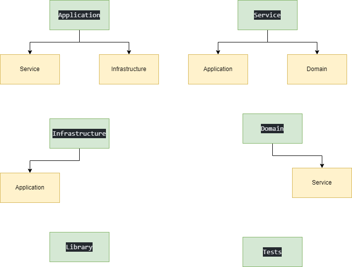

The updated analogy and communication between the layers in the context of a restaurant management system:

# Real-World Analogy:

Let's say you're building a restaurant management system. Here's how each layer corresponds to different parts of the restaurant:

- Application Layer: The application layer represents the front-of-house staff who interact with customers, take orders, and coordinate with the kitchen staff. They facilitate the ordering process and ensure a smooth dining experience.

- Service Layer: The service layer represents the kitchen staff, including the head chef and sous chefs. They prepare and cook the food according to the recipes and standards defined by the restaurant.

- Infrastructure Layer: The infrastructure layer represents the suppliers who provide ingredients, kitchen equipment, and other resources needed to run the restaurant. They ensure the availability of necessary supplies and equipment for the kitchen.

- Domain Layer: The domain layer represents the unique recipes, menu, and culinary style of the restaurant. It encapsulates the core business logic and rules specific to the restaurant's cuisine.

- Library Layer: The library layer represents the shared cooking techniques, practices, and utilities used by the kitchen staff. It provides reusable components and tools that enhance efficiency and consistency in food preparation.

- Tests Layer: The tests layer represents the quality control processes that ensure the food meets the restaurant's standards. It includes various testing mechanisms to verify the correctness and quality of the dishes prepared.

Communication Between Layers:

- Application Layer communicates with Service Layer: The application layer sends orders and requests to the service layer to initiate food preparation and retrieve relevant information about the dishes.

- Service Layer communicates with Application Layer and Domain Layer: The service layer receives orders and requests from the application layer, processes them using the business logic defined in the domain layer, and returns the results or status back to the application layer.

- Infrastructure Layer communicates with Application Layer: The infrastructure layer interacts with the application layer to handle external integrations, such as payment gateways, inventory management systems, or delivery services.

- Domain Layer communicates with Service Layer: The domain layer provides the core business logic and rules to the service layer, which leverages this logic to prepare the food according to the recipes and standards defined in the domain.

- Library Layer can be accessed by other layers: The library layer provides shared cooking techniques, practices, and utilities that can be accessed by the service layer or other layers to enhance efficiency and consistency in food preparation.

- Tests Layer interacts with other layers: The tests layer interacts with the application layer, service layer, and domain layer to perform automated testing, validate the correctness of business logic, and ensure the quality of the food produced.

By defining these communication patterns between the layers, you establish clear responsibilities and maintain a separation of concerns, enabling better maintainability, testability, and scalability of your restaurant management system.

 illustrate the communication between layers in the restaurant management system:

Imagine that you are a customer at a restaurant. You sit down at your table and are greeted by a friendly waiter (representing the application layer). You tell the waiter what you would like to eat (representing a request from the application layer to the service layer).

The waiter then goes to the kitchen (representing the service layer) and relays your order to the chef (representing the domain layer). The chef prepares your meal using their secret recipes (representing the core business logic of the domain layer) and sends it back out to the waiter.

The waiter then brings your meal back to your table (representing a response from the service layer to the application layer) and asks if you need anything else (representing further interaction between the application and service layers). You request a glass of water, so the waiter goes to the bar (representing the infrastructure layer) and retrieves a glass of water for you.

Meanwhile, the kitchen staff is using a set of shared utensils (representing the library layer) to prepare other meals for other customers. And in the background, a health inspector (representing the tests layer) periodically checks the restaurant's compliance with health and safety regulations.

Overall, the layers work together seamlessly to provide you with a great dining experience, with each layer focused on its own specific responsibilities.

- Application layer example: The application layer in a restaurant management system could be a tablet application used by the waiter to take orders from customers. This layer can communicate with the service layer to send the order to the kitchen, and can also communicate with the infrastructure layer to access payment systems. For example, the waiter may use the tablet application to send a customer's order to the kitchen and to process their payment using a credit card reader.

- Service layer example: The service layer in a restaurant management system could be a set of APIs that handle incoming requests from the application layer and return responses. For example, the service layer could receive an order request from the tablet application used by the waiter and communicate with the kitchen staff in the domain layer to prepare the order and return a response back to the application layer.

- Infrastructure layer example: The infrastructure layer in a restaurant management system could be the Wi-Fi network used by the tablets and other devices in the restaurant. This layer can communicate with the application layer to provide access to external systems such as payment gateways or inventory management systems. For example, the tablet application used by the waiter needs to connect to the Wi-Fi network to communicate with the service layer and access external systems.

- Domain layer example: The domain layer in a restaurant management system could be the kitchen staff who prepare the food and manage inventory. This layer can communicate with the service layer to access core business logic such as recipes and ingredients. For example, the chef in the kitchen needs to know the recipe for a particular dish and the available ingredients to prepare it.

- Library layer example: The library layer in a restaurant management system could be a set of reusable utility classes that are shared across different layers. For example, a utility class for validating credit card numbers could be used by both the application layer and the infrastructure layer.

- Tests layer example: The tests layer in a restaurant management system could be a set of automated tests that check the functionality and performance of the different layers. For example, an automated test could be used to check that the kitchen staff can handle a high volume of orders during peak hours, or that the payment gateway in the infrastructure layer is functioning correctly.
